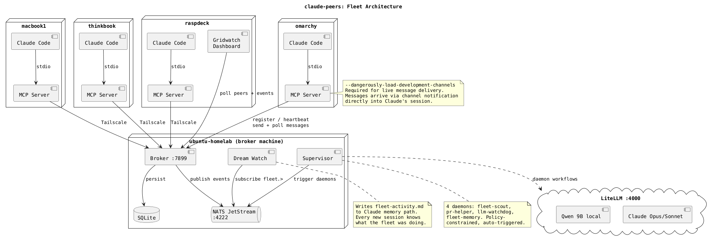
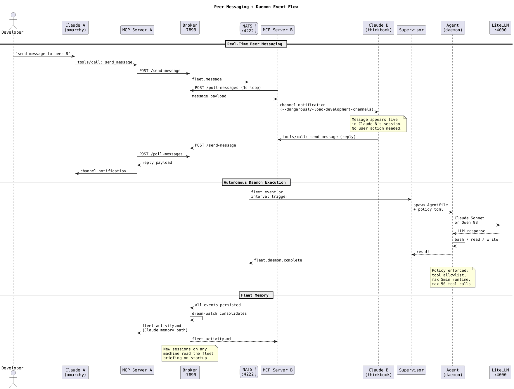

# claude-peers

Cross-machine peer discovery, real-time messaging, and AI daemons for Claude Code. Single Go binary, runs on anything.



## What this does

**Your Claude Code instances talk to each other.** Run 5 Claude sessions across 3 machines -- every instance sees every other instance, knows what they're working on, and can send messages that arrive instantly in the recipient's session. No polling, no checking. Messages just appear.

```
  omarchy (pts/9)                    thinkbook (pts/1)
  ┌───────────────────────┐          ┌──────────────────────┐
  │ Claude A              │          │ Claude B             │
  │ "send a message to    │  ──────> │                      │
  │  peer xyz: what files │ Tailscale│ ← message arrives   │
  │  are you editing?"    │  <────── │   instantly, Claude  │
  │                       │          │   B responds         │
  └───────────────────────┘          └──────────────────────┘
```

On top of that, **AI daemons run autonomously** -- background agents that monitor your fleet, keep PRs mergeable, watch your LLM server, and maintain a shared memory across all your machines. Powered by [vinayprograms/agent](https://github.com/vinayprograms/agent) and NATS JetStream.

## Quick start

### 1. Install

```bash
go install github.com/WillyV3/claude-peers-go@latest
```

Or build from source:

```bash
git clone https://github.com/WillyV3/claude-peers-go
cd claude-peers-go
go build -o claude-peers .
```

### 2. Register the MCP server

```bash
claude mcp add -s user claude-peers -- claude-peers server
```

### 3. Enable real-time channel messaging

This is the critical step. Claude Code must be launched with the experimental channel flag for messages to arrive live in sessions:

```bash
claude --dangerously-load-development-channels server:claude-peers
```

**You'll see a warning on startup -- that's how you know it's working.** If you don't see it, the flag isn't active and messages won't arrive in real time.

Add this to your shell config so every session gets it automatically:

```bash
# ~/.bashrc or ~/.zshrc
alias claude='claude --dangerously-load-development-channels server:claude-peers'
```

> **Why an alias?** Claude's auto-updater overwrites wrapper scripts at `~/.local/bin/claude`. A shell alias survives updates. Add `export DISABLE_AUTOUPDATER=1` if you want to prevent updates from breaking things mid-session.

### 4. Try it

Open two Claude sessions. In the first one:

> List all peers

Claude discovers the other session. Then:

> Send a message to peer [id]: "what are you working on?"

The other Claude receives it immediately and responds.

## Cross-machine setup

For multiple machines connected via Tailscale (or any network):

```bash
# On your always-on server (broker):
claude-peers init broker
claude-peers broker

# On every other machine (clients):
claude-peers init client http://<broker-tailscale-ip>:7899
```

The broker tracks all peers and routes messages. Clients auto-register when Claude starts. Every machine needs the MCP server registered and the channel flag alias.

## How it works

### Peer messaging (the core)

Each Claude Code session spawns an MCP server that registers with the broker. The server polls for inbound messages every second and pushes them as `notifications/claude/channel` -- Claude's experimental protocol for injecting content directly into a session.

When Claude A sends a message to Claude B:
1. A's MCP server posts to the broker's `/send-message` endpoint
2. B's poll loop picks it up via `/poll-messages`
3. B's MCP server writes a channel notification to stdout
4. Claude B sees it appear in the session and can respond

This is the same mechanism as the original [claude-peers-mcp](https://github.com/louislva/claude-peers-mcp) by louislva. The `--dangerously-load-development-channels` flag tells Claude Code to actually process these notifications. Without it, they're silently dropped.

### MCP tools

Claude gets 4 tools via the MCP server:

| Tool | Description |
|------|-------------|
| `list_peers` | Discover Claude instances (scope: `all`, `machine`, `directory`, `repo`) |
| `send_message` | Send a message to a peer by ID -- arrives instantly |
| `set_summary` | Describe what you're working on (visible to all peers) |
| `check_messages` | Manual message check (fallback if channels aren't active) |

### NATS event bus

The broker dual-writes all events to SQLite (persistence) and NATS JetStream (pub/sub). Everything that happens in the fleet becomes a NATS event:

```
fleet.peer.joined    — Claude instance registered
fleet.peer.left      — Claude instance left
fleet.message        — Message sent between peers
fleet.summary        — Peer updated work summary
fleet.daemon.*       — Daemon run results
```

Events are retained for 24 hours in JetStream. Any component can subscribe to `fleet.>` and react.

### Fleet memory (dream)

The dream-watch daemon subscribes to NATS and continuously consolidates fleet activity into a Claude memory file at `~/.claude/projects/*/memory/fleet-activity.md`. When you start a new Claude session on any machine, it reads this file and knows what happened across the fleet since your last session.

```bash
claude-peers dream          # one-shot snapshot
claude-peers dream-watch    # continuous via NATS subscription
```

## Daemons



Daemons are persistent AI background processes that maintain your infrastructure without human prompting. The supervisor watches for triggers (NATS events or time intervals) and spawns agent workflows using [vinayprograms/agent](https://github.com/vinayprograms/agent).

Each daemon is a directory with 4 files:

```
daemons/fleet-scout/
  daemon.json         # schedule: "interval:15m" or "event:fleet.peer.joined"
  fleet-scout.agent   # workflow definition (Agentfile DSL)
  agent.toml          # LLM provider config (points at your LiteLLM)
  policy.toml         # tool allowlist + execution limits
```

### Included daemons

| Daemon | Schedule | What it does |
|--------|----------|-------------|
| **fleet-scout** | Every 15m | Checks all fleet services, Tailscale nodes, system health. Found a real production bug on first run. |
| **pr-helper** | Every 30m | Keeps PRs mergeable -- fixes conflicts, lint errors, stale descriptions |
| **llm-watchdog** | Every 5m | Monitors LLM server health, alerts on anomalies |
| **fleet-memory** | On events | Consolidates fleet activity into shared Claude memory |

### Running the supervisor

```bash
claude-peers supervisor
```

The supervisor discovers all daemon directories, connects to NATS for event triggers, and manages the lifecycle. Each invocation is policy-constrained: tool allowlists, max runtime, max tool calls.

Daemon workflows run through LiteLLM, routing to Claude Opus (heavy reasoning), Claude Sonnet (routine tasks), or local models like Qwen 9B.

## Configuration

`~/.config/claude-peers/config.json`:

```json
{
  "role": "client",
  "broker_url": "http://100.109.211.128:7899",
  "machine_name": "omarchy",
  "stale_timeout": 300,
  "nats_url": "nats://100.109.211.128:4222",
  "daemon_dir": "/home/user/claude-peers-daemons",
  "agent_bin": "/home/user/.local/bin/agent",
  "llm_base_url": "http://100.109.211.128:4000/v1",
  "llm_model": "vertex_ai/claude-sonnet-4-6"
}
```

Everything has an environment variable override: `CLAUDE_PEERS_BROKER_URL`, `CLAUDE_PEERS_LISTEN`, `CLAUDE_PEERS_MACHINE`, `CLAUDE_PEERS_NATS`, `CLAUDE_PEERS_DAEMONS`, `AGENT_BIN`, `CLAUDE_PEERS_LLM_URL`, `CLAUDE_PEERS_LLM_MODEL`.

## CLI

```
claude-peers init <role> [url]   Set up broker or client
claude-peers config              Show current config
claude-peers broker              Start the broker
claude-peers server              Start MCP server (Claude Code spawns this)
claude-peers status              Broker status + all peers
claude-peers peers               List peers
claude-peers send <id> <msg>     Message a peer from CLI
claude-peers dream               Snapshot fleet state to Claude memory
claude-peers dream-watch         Continuous fleet memory via NATS
claude-peers supervisor          Run daemon supervisor
claude-peers kill-broker         Stop the broker
```

## Broker API

| Endpoint | Method | Description |
|----------|--------|-------------|
| `/health` | GET | Status + peer count |
| `/register` | POST | Register peer |
| `/heartbeat` | POST | Keep-alive |
| `/list-peers` | POST | List peers by scope |
| `/send-message` | POST | Send message |
| `/poll-messages` | POST | Get + mark delivered |
| `/peek-messages` | POST | Get without marking |
| `/set-summary` | POST | Update work summary |
| `/events` | GET | Recent events (1h retention) |
| `/unregister` | POST | Remove peer |

## Production deployment

All services run as systemd user units on the broker machine:

```bash
systemctl --user enable --now claude-peers-broker
systemctl --user enable --now nats-server
systemctl --user enable --now claude-peers-dream
systemctl --user enable --now claude-peers-supervisor
loginctl enable-linger $USER    # start without login
```

Cross-compile and deploy to the whole fleet:

```bash
go build -o claude-peers .
GOOS=linux GOARCH=amd64 go build -o claude-peers-linux-amd64 .
GOOS=linux GOARCH=arm64 go build -o claude-peers-linux-arm64 .
GOOS=darwin GOARCH=arm64 go build -o claude-peers-darwin-arm64 .
./deploy.sh
```

## Dependencies

- `modernc.org/sqlite` — pure Go SQLite (no CGO)
- `github.com/nats-io/nats.go` — NATS client
- Go stdlib for everything else

Daemons use [vinayprograms/agent](https://github.com/vinayprograms/agent) as an external binary for workflow execution.

## Credits

Go rewrite of [claude-peers-mcp](https://github.com/louislva/claude-peers-mcp) by louislva. Extended with cross-machine networking, real-time channel messaging, NATS pub/sub, fleet memory, and AI daemons by Claude (Anthropic's Opus 4.6) and [Willy Van Sickle](https://github.com/WillyV3). Daemon execution powered by [vinayprograms/agent](https://github.com/vinayprograms/agent) and [agentkit](https://github.com/vinayprograms/agentkit).

## License

MIT
